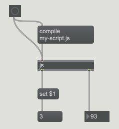

# maxmsp-es6-nodejs-babel-workflow

This repository may help you if:
- you like writing complex JS scripts for Max/MSP
- you would like to debug and run scripts into a more convenient environment (Node.js)
- you would like to use the cool ES6 syntax (with [Babel](https://babeljs.io/))
- ... and you don't know how to do it.

## The problem

Including Max/MSP scripts into regular Node.js files is problematic because of...
 
... Max `js` object properties which can be seen as undeclared variables:

    autowatch = 1;
    inlets = 0;
    outlets = 2;

... messages which have to be called to debug scripts:

    function bang()
    {
        outlet(0, 'blip & blop');
    }

... methods defined in the [global Max Javascript context](https://docs.cycling74.com/max7/vignettes/jsglobal) which do not exist in Node.js:

    post('Coucou');

## The concept

First, we need to export messages in scripts so as to call them outside with the CommonJS modules syntax:

    // script.js
    function bang()
    {
        outlet(0, 'blip & blop');
    }
    exports.bang = bang;
    
    // main.js
    const s = require('./script.js);
    s.bang();

However, Max may throw a: *Javascript ReferenceError: exports is not defined, line XXX*. Let's just wrap the `exports` into a `try/catch (which is a very unelegant way to deal with these probleme, but I don't care):

    try {
      exports.bang = bang;
    } catch (e) {
    }
    
Then, we need to define a main *playground* file in which scripts will be included and executed, and which define useful Max global stuff:

    // playground.js
    global.post = message => process.stdout.write(message);
    global.outlet = (...args) => process.stdout.write('OUTLET', args.map(JSON.stringify).join(' --> ').substring(0, 69) + '...');
    
    import {bang} from './src/my-script';
    bang();

You can provide your own implementation for `post` (the way things appear in the console) and `outlet` (a side effect which help you to debug the output of your scripts).    

## The process

Have a look on `package.json`, three NPM tasks are defined:

  - `npm run play`: transpile the code and launch your playground file to debug and run your scripts in a terminal (see `playground.js`).
  - `npm run build`: take all your scripts and transpile them to ES5 so as to use them in Max/MSP. In this a repository are given an example script (`src/my-script.js`) as well as an example dependency (`src/my-lib.js`). You can specify the directory in which the transpiled files appear (`babel src -d ./<YOUR OUTPUT DIRECTORY>`). Your scripts must be available to your Max/MSP environment.  
  - `npm run clean`: erase all js files generated by a previous `build` task.

*Nota bene: Babel plugin `transform-remove-strict-mode` (declared in `.babelrc`) prevents Babel to add `"use strict"` at the beginning of transpiled scripts.*

